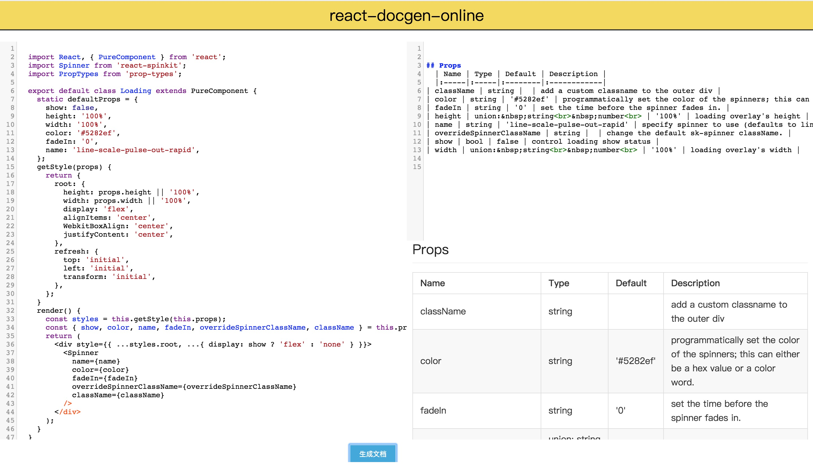

### react-docgen-online

React 组件属性在线生成工具  
[在线地址](https://phobal.github.io/react-docgen-online/)

### Why

当我们在写通用的 `react` 组件时常常需要对组件的属性写文档，[react-docgen](https://github.com/reactjs/react-docgen) 库是一个非常优秀的 `react` 文档生成工具，它将你的组件转化为 `AST` 然后进行词法分析，提取出 `name`、`props`、`methods` 等组件中定义的属性或者方法，我们可以很自由的将这些信息输出成相应的文档。  
大多数情况我们可能只是需要组件中的 `props` 属性，因为这个是使用中更加关心的问题，但是有时候我们只是写一个小小的组件，还得花可能比写这个组件多的时间去写文档，感觉很冤枉，所以为了更快的将这些属性提取出来并生成 `markdown` 文档，[react-docgen-online](https://phobal.github.io/react-docgen-online/) 产生了。  
### Usage

将需要`exports` 出去的组件拷贝到左侧代码输出框内，点击右下角 `生成文档` 按钮 ，在右侧区域的代码框内就能看到生成好的 `markdown` 格式的属性文档，右下方有预览模式，可以很直观的看到属性值。

